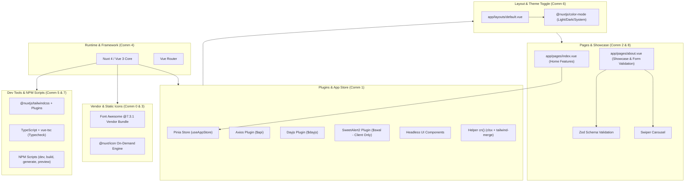

# Nuxt Frontend Starter Template & Portfolio Architecture

A versatile, full-featured frontend architecture built on **Nuxt (Vue 3)** and **TypeScript**, engineered to flexibly support **SSR (Server-Side Rendering)**, **CSR (Client-Side SPA)**, and **SSG (Static Site Generation)** for [dianadi021.github.io](https://dianadi021.github.io).

---

## 🗺️ Peta Arsitektur & Dependency Graph

Berdasarkan mapping struktur pada [`graphify-out/GRAPH_REPORT.md`](file:///home/wannacry021/Public/Project/Skuad/dianadi021.github.io/graphify-out/GRAPH_REPORT.md), sistem ini terbagi dalam beberapa komunitas modul yang saling terhubung:



### Ringkasan Hubungan Komunitas (Community Hubs)
- **Community 1 (Plugins and App Store):** Menyediakan jembatan utilitas (`$api`, `$dayjs`, `$swal`, `cn()`) dan store reaktif `useAppStore` yang diinjeksi ke seluruh aplikasi.
- **Community 2 (About Page Demo Logic):** Mengintegrasikan interaksi form Zod, HTTP request simulasi via Axios, carousel Swiper, dan alert SweetAlert2.
- **Community 6 (Default Layout Theme Toggle):** Mengatur tata letak global, navigasi, hidrasi tema tanpa flicker (`@nuxtjs/color-mode`), dan footer.
- **Community 8 (Home Page Features):** Halaman awal yang menyajikan ringkasan fitur, kalkulasi tanggal lokal (`$dayjs`), dan showcase kapabilitas Nuxt.
- **Community 0 & 3 (Minified Icon Library Bundle & Vendor Scripts):** Aset Font Awesome lokal di `public/assets/scripts/vendor/font-awesome/@7.3.1/` yang dimuat via head config `nuxt.config.ts`.
- **Community 4, 5, 7 (Dependencies, Dev Tools & NPM Scripts):** Fondasi dependency dan automasi command line.

---

## 🚀 Fitur & Package yang Terintegrasi (`package.json`)

### 1. Runtime Dependencies

| Kategori | Package | Versi | Deskripsi & Peran dalam Sistem |
| :--- | :--- | :--- | :--- |
| **Framework Engine** | `nuxt` | `^4.5.2` | Framework inti berbasis Vue 3 dengan Nitro engine, file-based routing, dan auto-imports. |
| **Reactivity & Routing** | `vue` / `vue-router` | `^3.5.43` / `^5.3.1` | Core reactive system dan client-side routing. |
| **State Management** | `pinia` | `^4.0.3` | State management modular, type-safe, dan reaktif (digunakan di `app/stores/app.ts`). |
| **Theme / Dark Mode** | `@nuxtjs/color-mode` | `^4.0.1` | Pengaturan mode gelap/terang otomatis (system/light/dark) bebas flicker saat SSR. |
| **Composables Utility** | `@vueuse/nuxt` & `@vueuse/core` | `^15.0.0` | Kumpulan ratusan helper composable reaktif untuk API browser dan event handling. |
| **Iconography** | `@nuxt/icon` | `^2.5.1` | Penyedia ikon on-demand universal (Iconify, Heroicons, Lucide). |
| **UI Components** | `@headlessui/vue` | `^1.7.23` | Komponen antarmuka WAI-ARIA accessible tanpa styling bawaan (dialog, menu, listbox). |
| **Touch Slider / Carousel** | `swiper` | `^14.3.0` | Komponen carousel modern untuk showcase proyek atau galeri portofolio responsif. |
| **HTTP Client** | `axios` | `^1.20.0` | HTTP request client terpusat di `app/plugins/axios.ts` (`$api`) dengan interceptor. |
| **Date Time** | `dayjs` | `^1.11.23` | Library manipulasi waktu ringan dengan plugin `relativeTime` dan konfigurasi locale ID. |
| **Modal / Dialog** | `sweetalert2` | `^11.26.25` | Alert modal interaktif dan aman di client-side (`app/plugins/sweetalert2.client.ts`). |
| **Class Helpers** | `clsx` & `tailwind-merge` | `^2.1.1` & `^3.7.0` | Membentuk helper `cn()` (`app/utils/cn.ts`) untuk menggabungkan class Tailwind tanpa bentrok. |
| **Data Validation** | `zod` | `^4.6.5` | Skema validasi TypeScript-first untuk validasi input formulir dan data API. |

### 2. Developer Tooling & Plugins

| Package | Versi | Deskripsi & Peran |
| :--- | :--- | :--- |
| `@nuxtjs/tailwindcss` | `^6.14.0` | Integrasi resmi Tailwind CSS v3 ke siklus kompilasi Nuxt. |
| `@pinia/nuxt` | `^1.0.2` | Modul integrasi Pinia ke Nuxt dengan auto-import store hooks (`useAppStore`). |
| `@tailwindcss/typography` | `^0.5.20` | Plugin styling kelas `prose` untuk rendering konten teks dan artikel. |
| `@tailwindcss/forms` | `^0.5.11` | Normalisasi dan reset styling default elemen form HTML. |
| `@tailwindcss/aspect-ratio`| `^0.4.2` | Utilitas rasio aspek proporsional untuk responsivitas gambar dan video. |
| `typescript` | `^5.9.3` | Engine static typing untuk keamanan tipe di seluruh project. |
| `@types/node` | `^26.6.4` | Definisi tipe TypeScript untuk API Node.js. |
| `vue-tsc` | `^3.3.12` | Compiler typecheck khusus Vue SFC untuk memverifikasi integritas template dan script. |

---

## 📁 Struktur Direktori

```text
dianadi021.github.io/
├── app/
│   ├── assets/
│   │   └── css/
│   │       └── main.css              # Directive Tailwind CSS (@tailwind base, etc.)
│   ├── layouts/
│   │   └── default.vue               # Layout global (Navbar, theme switcher, footer)
│   ├── pages/
│   │   ├── index.vue                 # Halaman Beranda (Fitur & Ringkasan)
│   │   └── about.vue                 # Showcase integrasi seluruh library & form demo
│   ├── plugins/
│   │   ├── axios.ts                  # Injeksi $api dengan interceptor baseURL
│   │   ├── dayjs.ts                  # Injeksi $dayjs dengan locale ID & relativeTime
│   │   └── sweetalert2.client.ts     # Injeksi $swal (CSR-safe client plugin)
│   ├── stores/
│   │   └── app.ts                    # Pinia store useAppStore()
│   ├── utils/
│   │   └── cn.ts                     # Helper class merger (clsx + tailwind-merge)
│   └── app.vue                       # Root Nuxt entrypoint dengan NuxtLayout & NuxtPage
├── graphify-out/
│   └── GRAPH_REPORT.md               # Peta arsitektur graphify (nodes, edges, communities)
├── public/
│   ├── assets/scripts/vendor/        # Aset script pihak ketiga (Font Awesome @7.3.1)
│   ├── favicon.ico                   # Favicon situs
│   └── robots.txt                    # Panduan crawling crawler mesin pencari
├── .github/
│   └── workflows/
│       └── deploy-pages.yml          # GitHub Actions CI/CD deployment ke GitHub Pages
├── CONTEXT.md                        # Konteks developer, profil, tools, & aturan design system
├── AGENTS.md                         # Protokol navigasi dan aturan kerja agent
├── nuxt.config.ts                    # Konfigurasi Nuxt, SSR/CSR routeRules, modul, & meta
├── tailwind.config.ts                # Konfigurasi Tailwind, palet warna, & dark mode class
├── tsconfig.json                     # Konfigurasi TypeScript
└── package.json                      # Daftar script dan dependencies
```

---

## ⚙️ Mode Rendering & Route Rules

Nuxt berjalan dengan **SSR (Server-Side Rendering)** aktif secara default. Atur rendering khusus melalui `routeRules` pada [`nuxt.config.ts`](file:///home/wannacry021/Public/Project/Skuad/dianadi021.github.io/nuxt.config.ts):

```ts
routeRules: {
  '/admin/**': { ssr: false },        // Client-Side Only (SPA)
  '/static/**': { prerender: true }  // Pre-rendered saat build (SSG)
}
```

- **SSR (Default):** Seluruh halaman di-render awal di server untuk SEO optimal dan performa load pertama.
- **SSG (`npm run generate`):** Menghasilkan file HTML/JS/CSS statis di `.output/public` yang siap di-deploy ke GitHub Pages.
- **CSR (`ssr: false`):** Hanya menyajikan skeleton HTML awal dan menjalankan seluruh rendering di peramban klien.

---

## 🛠️ Perintah CLI (NPM Scripts)

Setiap script yang didefinisikan dalam `package.json` memiliki peruntukan spesifik dalam siklus pengembangan:

```bash
# 1. Menjalankan server lokal pengembangan (dengan HMR aktif)
npm run dev

# 2. Melakukan pemeriksaan tipe TypeScript di seluruh file .ts dan .vue
npm run typecheck

# 3. Menghasilkan build produksi untuk server berbasis Node.js / Nitro (SSR)
npm run build

# 4. Melakukan pre-rendering halaman ke format statis (SSG untuk GitHub Pages)
npm run generate

# 5. Menjalankan server preview lokal untuk menguji build produksi
npm run preview

# 6. Menyiapkan stub tipe dan konfigurasi internal .nuxt (dijalankan otomatis setelah npm install)
npm run postinstall
```

---

## 🧩 Injeksi Plugin & Context Usage

Nuxt menyuntikkan helper global via `useNuxtApp()`. Hindari membuat instansiasi ganda di dalam komponen:

```vue
<script setup lang="ts">
// Akses plugin terpusat
const { $api, $dayjs, $swal } = useNuxtApp()
const appStore = useAppStore()

// Penggunaan Dayjs
const formattedDate = $dayjs().format('dddd, DD MMMM YYYY')

// Penggunaan SweetAlert2 (hanya panggil saat interaksi user atau di onMounted)
const triggerNotification = () => {
  if ($swal) {
    $swal.fire({
      title: 'Notifikasi',
      text: 'Aksi berhasil dieksekusi!',
      icon: 'success'
    })
  }
}
</script>
```

---

## 🚀 Panduan Deployment

### 1. Deploy ke GitHub Pages (SSG - dianadi021.github.io)
Repository ini telah dilengkapi dengan GitHub Actions workflow `.github/workflows/deploy-pages.yml`.
1. Pastikan pengaturan di GitHub: **Repository Settings → Pages → Build and deployment → Source: GitHub Actions**.
2. Workflow akan secara otomatis menjalankan:
   ```bash
   npm ci
   npm run generate
   ```
3. Direktori hasil output statis `.output/public` akan diunggah dan disajikan langsung di domain GitHub Pages.
4. Jika menggunakan custom domain atau base path kustom, atur environment variable `NUXT_APP_BASE_URL` (default: `/`).

### 2. Deploy ke Vercel / Node Server (SSR)
1. Hubungkan repository ke dashboard Vercel.
2. Vercel akan secara otomatis mengenali framework Nuxt dan menjalankan `npm run build`.
3. Server Nitro akan menjalankan rendering SSR secara dinamis di edge/serverless runtime Vercel.
